# Tugas 1 IF3110 Pengembangan Aplikasi Berbasis Web
Membuat sebuah Website Toko Buku

tampilan aplikasi, dokumentasi yang menjelaskan website yang Anda buat, dan penjelasan mengenai pembagian tugas masing-masing anggota
## Pro-Book

**Pro Book** merupakan aplikasi toko buku online berbasis web yang memungkinkan seorang pengguna untuk membeli dan memberi komentar pada buku. Terdapat fitur order untuk membeli dan review untuk menambah komentar mengenai buku yang diorder. Pengguna dapat melakukan register dan perlu melakukan login terlebih dahulu jika telah terdaftar pada aplikasi ini.

## Anggota Tim
K01 - azkanoob
* Azka Nabilah Mumtas 13516013
* Sinaga Yoko Christoffel T   13516052
* Yasya Rusyda Aslina 13516091

## Dokumentasi

Pada saat pertama kali pengguna masuk ke aplikasi, browser akan mengarahkan untuk ke halaman login

### Login

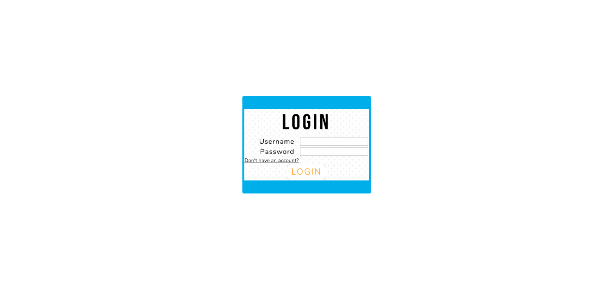

Pengguna dapat melakukan login sebagai user. Jika belum memiliki akun, pengguna dapat melakukan register dengan menekan link *Don't have an account?*

### Register

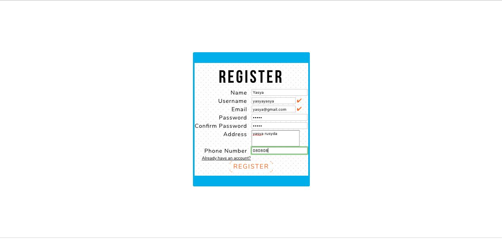

Pengguna dapat mendaftarkan diri sebagai user agar dapat menggunakan aplikasi ini. Pengguna tidak dapat mendaftarkan diri menggunakan email dan/atau username yang sudah pernah digunakan sebelumnya. Jika email dan username valid akan ditandai dengan lambang centang seperti pada gambar. Setelah mendaftarkan diri, pengguna akan secara otomatis login dengan user yang baru didaftarkannya.

Setelah pengguna terdaftar dan masuk ke dalam aplikasi maka pengguna akan diarahkan ke halaman browse (search book)

### Search-Books

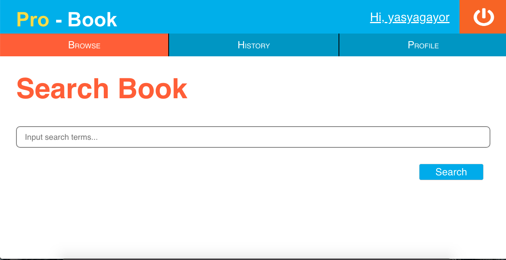

Search-Books merupakan halaman utama yang ditampilkan ketika user telah login. Pada halaman Search-Books, terdapat sebuah input field dapat diisi pengguna untuk melakukan pencarian buku berdasarkan judul.

Setelah pengguna menekan tombol search, pengguna akan dibawa ke halaman Search-Result.

### Search-Result

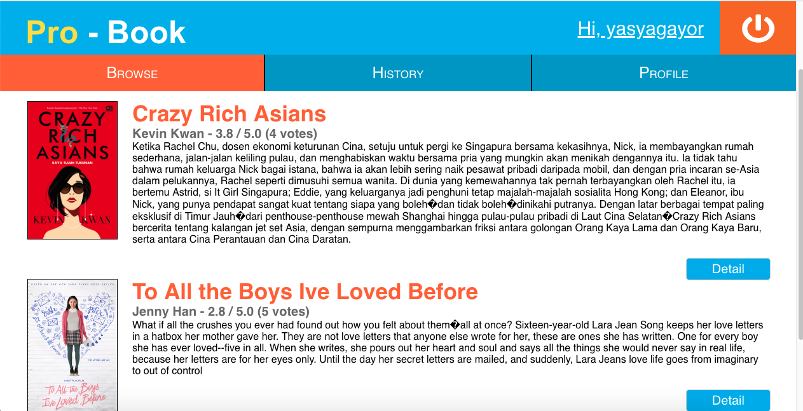

Pada Search-Result, ditampilkan daftar buku dan jumlah hasil pencarian. Pada tiap entri buku ditampilkan judul, penulis, gambar, potongan sinopsis, serta rating dari buku tersebut. Jika tombol detail ditekan, pengguna akan dibawa ke halaman Book-Detail dari buku yang bersangkutan.

### Book-Detail

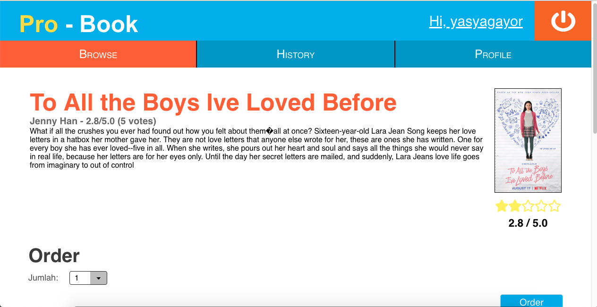
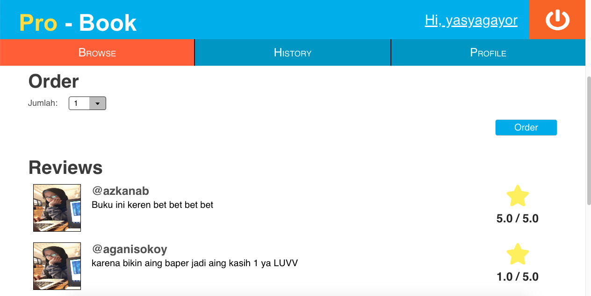

Pada halaman ini, ditampilkan detail buku yang terdiri dari judul, penulis, gambar, rating, serta komentar dan rating dari user lain.

Pada halaman ini juga disediakan dropdown untuk memasukkan jumlah buku yang ingin dipesan dan tombol order. Jika tombol order ditekan, proses pemesanan akan dilakukan, yang berarti halaman tidak akan di-*refresh* setelah tombol order ditekan. Tidak ada proses pembayaran yang ditangani oleh sistem.

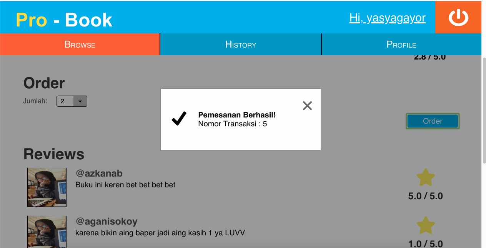

Setelah proses pemesanan selesai dilakukan, akan muncul notifikasi pada browser pengguna. Informasi yang diberikan oleh notifikasi mengikuti contoh.

Pengguna dapat melihat informasi mengenai data pengguna pada halaman profile, tombol profile terdapat pada header.

### Profile

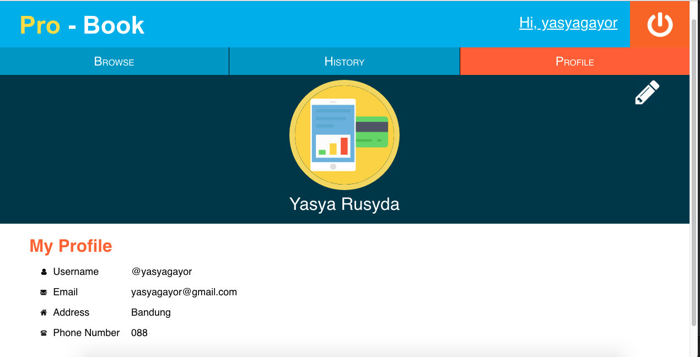

Pada halaman ini, ditampilkan nama lengkap, username, email, alamat, nomor telepon, dan foto profil. Pada bagian kanan atas terdapat tombol edit, jika pengguna menekan tombol tersebut, pengguna dibawa ke halaman Edit-Profile.

### Edit-Profile

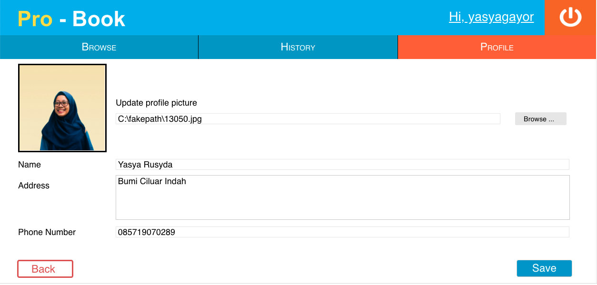

Pada halaman ini, pengguna dapat mengubah nama yang ditampilkan, alamat, nomor telepon, dan foto profil.

Pada bagian bawah halaman, terdapat tombol Back dan Save. Jika tombol Back ditekan, pengguna kembali ke halaman Profile tanpa mengubah informasi profilnya. Jika tombol save ditekan, nama dan alamat pengguna akan diganti sesuai input field, dan pengguna dibawa ke halaman Profile.

Pengguna dapat melihat riwayat ordernya pada halaman history (tombol menuju halaman tersebut tertera pada header)

### History

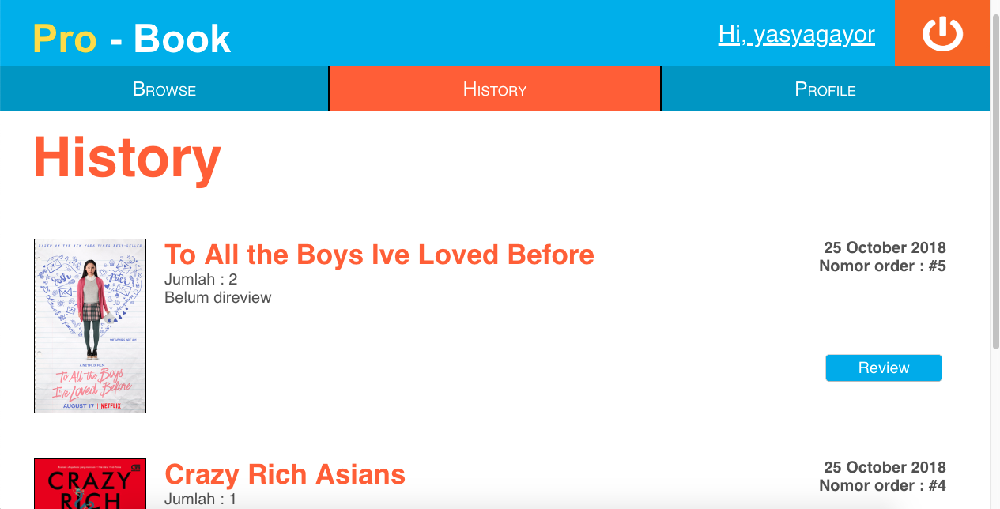

Pada halaman ini, ditampilkan daftar buku yang sudah pernah dipesan oleh pengguna, diurutkan berdasarkan waktu pemesanan dengan pesanan paling baru merupakan entri paling atas.

Pada tiap entri pada history, terdapat tombol review. Jika tombol review ditekan, pengguna akan dibawa ke halaman Review. Jika pengguna sudah memberikan review untuk order tersebut, tombol review akan hilang dari entri yang bersangkutan.

### Review

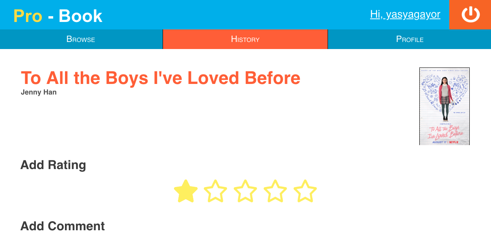
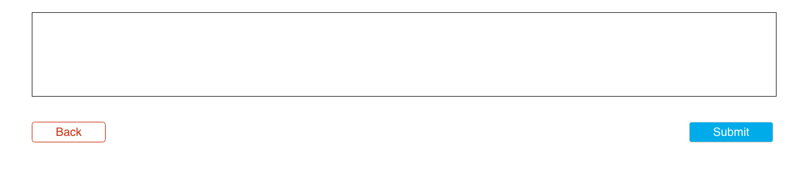

Pada halaman ini, pengguna dapat memberikan review untuk buku yang dipesan berupa rating dan komentar. Review yang diberikan dari halaman ini akan muncul pada halaman Book-Detail dari buku yang di-review. Setelah selesai, user akan dibawa kembali ke halaman History.

Dalam menelusuri aplikasi pengguna harus memerhatikan batasan-batasan seperti validasi form yaitu
### Validasi

Validasi **wajib** dilakukan pada *client-side*, dengan menggunakan **javascript** bukan HTML 5 input type, yaitu:
- Setiap field pada form tidak boleh kosong. 
- Email harus sesuai format email.
- Jumlah buku yang dipesan minimal 1.
- Rating buku hanya boleh bernilai 1-5.
- Nama pengguna maksimal 20 karakter.
- Nomor telepon pengguna minimal 9 digit dan maksimal 12 digit.

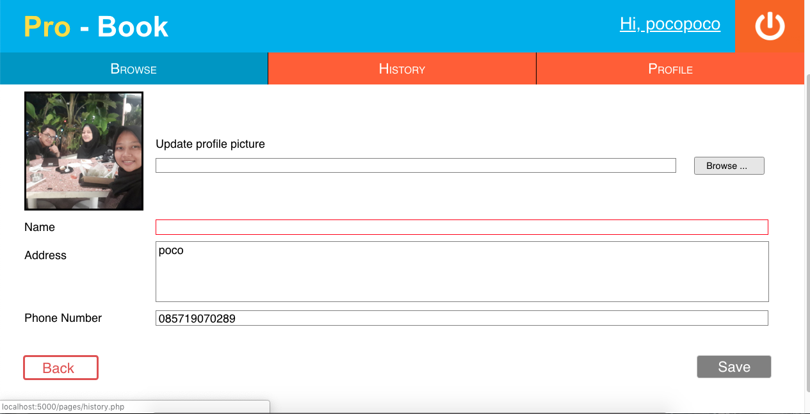

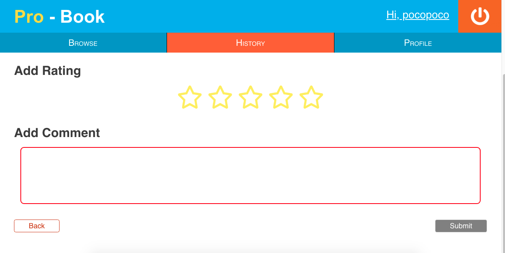

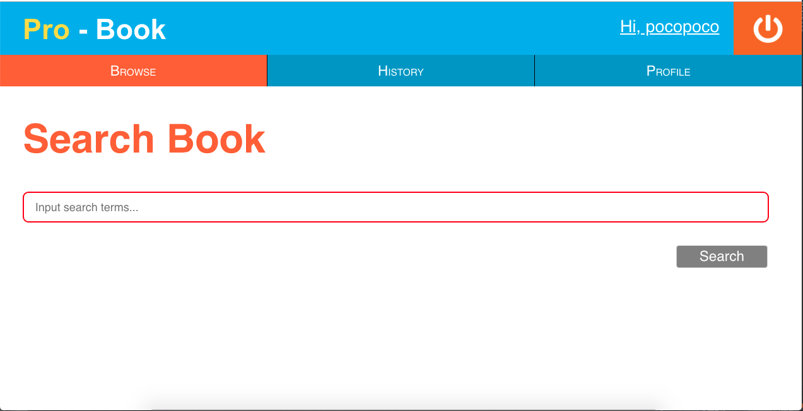

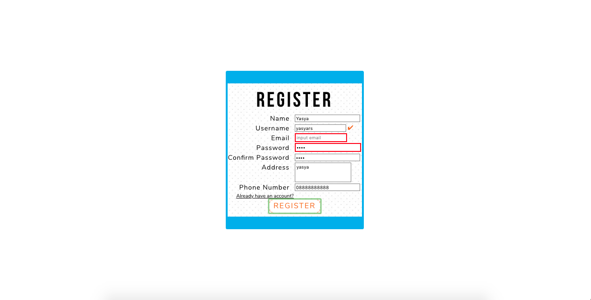
## Struktur File

Aplikasi ini terdiri dari tiga folder yaitu database, doc, dan src
* **doc** : berisi dokumen gambar tampilan aplikasi
* **database** : berisi file database .sql yang digunakan untuk pemrosesan data aplikasi
* **src** : berisi source code dan file gambar yang dibutuhkan untuk ditampilkan pada aplikasi. Folder ini terdiri dari 5 folder di dalamnya yaitu component, login, pages, register, dan upload
- **component** : berisi file yang dibutuhkan untuk menampilkan header, yaitu header.css dan header.php dan file gambar button
- **login** : berisi file untuk fitur login yaitu login.css , login.html, login.php dan file gambar
- **pages** : berisi source code mockup, fungsionalitas, dan file gambar untuk halaman-halaman yang perlu ditampilkan yaitu halaman browse, browsedetail, browse result, profile, edit profile, history serta untuk menghandle database
- **register** : berisi file untuk menampilkan dan fungsionalitas register
- **upload** : berisi file gambar profile picture untuk pengguna

### Pembagian Tugas

**Tampilan**
1. Login : 13516052
2. Register : 13516052
3. Header : 13516013
4. Search Books : 13516013
5. Search Results : 13516013
6. Search Detail : 13516013
7. History : 13516013
8. Review : 13516013
9. Profile : 13516091
10. Edit Profile : 13516091

**Fungsionalitas**
1. Login : 13516052
2. Register : 13516052
3. Header : 13516013, 13516052
4. Search Books : 13516013
5. Search Results : 13516013
6. Search Detail : 13516013
7. History : 13516013
8. Review : 13516013
9. Profile : 13516091
10. Edit Profile : 13516091
11. Database : 13516013, 13516091

## SELAMAT BERBELANJA BUKU

>“A reader lives a thousand lives before he dies . . . The man who never reads lives only one.”
>George R.R. Martin
